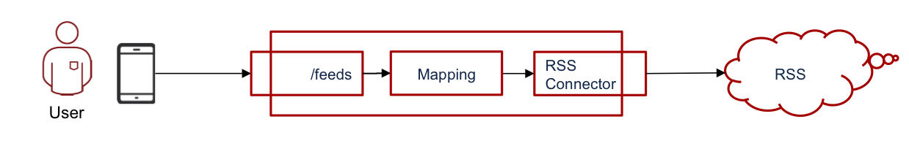
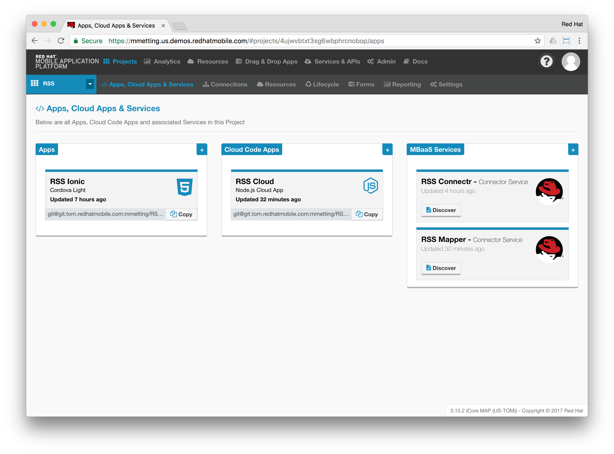

# RHMAP-Demo-Apps
## RHMAP-RSS-Reader-Demo
This is a [demo project](https://github.com/mmetting/RHMAP-RSS-Reader-Demo) utilising various capabilities of the Red Hat Mobile Application Platform. It consists of two client apps (iOS and Ionic) to show RSS feeds from the internet. The RSS feeds are offered by an API within a Cloud Application on Red Hat Mobile. Since feeds are usually exposed as XML-structured data, the feed is transformed and mobile-optimised by means within RHMAP: e.g. the usage of Node modules and the new API-Mapper capability.

## RHMAP-Forms-Submission-Viewer-Demo
This is a [demo project](https://github.com/torbjorndahlen/formsdemo) that uses the $fh.forms API to retrieve content submitted through an RHMAP Forms App. It consists of a web app that displays a list of submissions, using $fh.forms.getSubmissions from the Cloud App. When selecting a submission the $fh.forms.getSubmission is used to retrieve submitted content. The content is examined for the presence of a photo, in which case the $fh.forms.getSubmissionFile function is used with the groupId of the photo.

## RHMAP-Chat-Demo
This is a [demo project](https://github.com/torbjorndahlen/kollegornaserver) that uses the $fh.sync API to create a simple chat application.
