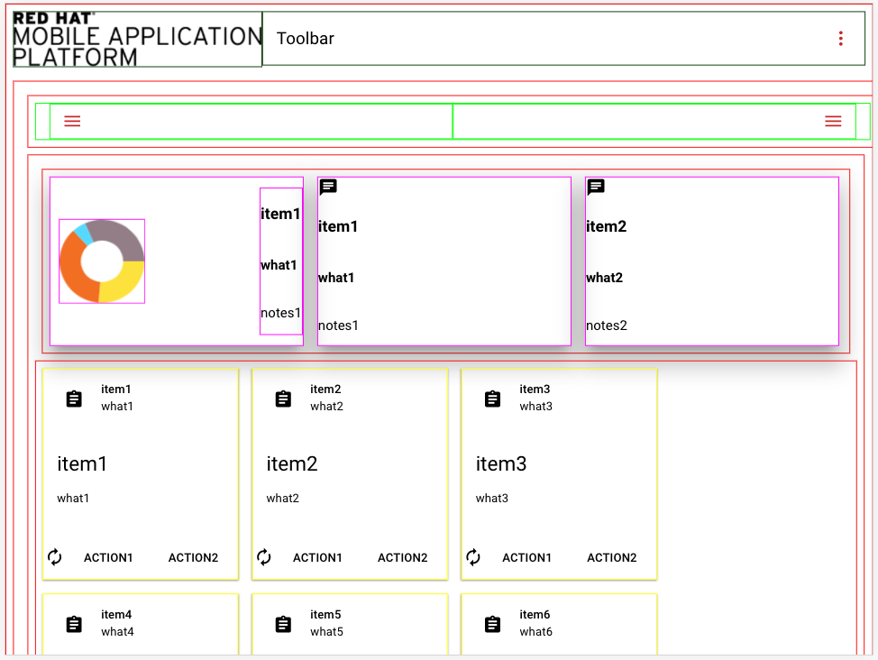
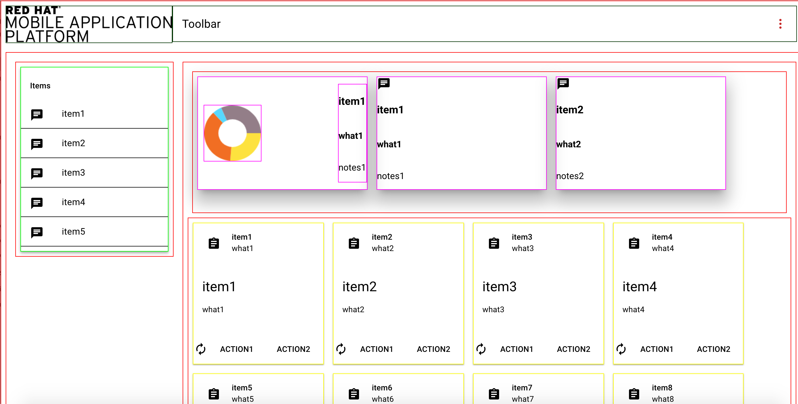

# RHMAP-Demo-Apps
## RHMAP-RSS-Reader-Demo
This is a [demo project](https://github.com/mmetting/RHMAP-RSS-Reader-Demo) utilising various capabilities of the Red Hat Mobile Application Platform. It consists of two client apps (iOS and Ionic) to show RSS feeds from the internet. The RSS feeds are offered by an API within a Cloud Application on Red Hat Mobile. Since feeds are usually exposed as XML-structured data, the feed is transformed and mobile-optimised by means within RHMAP: e.g. the usage of Node modules and the new API-Mapper capability.


## RHMAP-Forms-Submission-Viewer-Demo
This is a [demo project](https://github.com/torbjorndahlen/formsdemo) that uses the `$fh.forms` API to retrieve content submitted through an RHMAP Forms App. It consists of a web app that displays a list of submissions, using `$fh.forms.getSubmissions` from the Cloud App. When selecting a submission the `$fh.forms.getSubmission` is used to retrieve submitted content. The content is examined for the presence of a photo, in which case the `$fh.forms.getSubmissionFile` function is used with the groupId of the photo.

## RHMAP-Chat-Demo
This is a [demo project](https://github.com/torbjorndahlen/kollegornaserver) that uses the $fh.sync API to create a simple chat application.

## RHMAP-BPM-Integration Using Sync
To make a mobile app getting regular updates on changes made in tasks and processes in Red Hat JBoss BPM,
the `$fh.sync` framework can be used together with the [fh-connector-bpm](https://github.com/sebastianfaulhaber/fh-connector-bpm).
Using the `$fh.sync.globalInterceptRequest` function a `globalRequestInterceptor` that calls the connector on each sync cycle and then stores the result in a MongoDB Collection allows the mobile app to asynchronously retrieve the latest BPM process and task updates and present these to the user.
The following code example shows the `globalRequestInterceptor` in the Cloud App:

```
var $fh = require('fh-mbaas-api');

var globalRequestInterceptor = function(dataset_id, params, cb) {
  // This function will intercept all sync requests.
  // It is useful for checking client identities and
  // for validating authentication

  console.log('Intercepting request for dataset', dataset_id, 'with params', params);

  $fh.service({
    "guid": "guid to connector",
    "path": "/bpm/runtimeTaskQuery",
    "method": "POST",
    "headers": {
      "Content-Type" : "application/json"
    },
    "params": {
      "params": {"username": "BPM username", "password": "BPM password", "ip": "BPM ip", "port": "BPM port"}
    }
    }, function(err, body, response) {
      if ( err ) {
        console.log('service call failed - err : ' + err);
      } else {
        var options = {
          "act": "update",
          "type": "Name of collection",
          "guid": "GUID of document",
          "fields": {"Field name in document": JSON.stringify(body)}
        };
        fh.db(options, function (err, data) {
          if (err) {
            console.error("Error " + err);
          } else {
            console.log("Updated document with BPM data");
          }
        });
      }
    });

  // Return a non null response to cause the sync request to fail.
  // This (string) response will be returned to the client, so
  // don't leak any security information.
  return cb(null);
}

$fh.sync.globalInterceptRequest(globalRequestInterceptor);
```

Note that in order to reduce amount of data to be retrieved by the mobile app, all updates should be made to the same document, hence overwriting the previous update.
With this, the client app can use the $fh.sync API with the collection name as dataset Id and subscribe to updates in BPM process instances and tasks.
The following code example shows how to set up the sync framework in the mobile app:

```
var datasetId = "Name of collection";

$fh.sync.init({
  "do_console_log" : false,
  "storage_strategy" : "dom",
});

$fh.sync.manage(datasetId);

$fh.sync.notify(function(notification) {

    $fh.sync.doList(datasetId,
      function(res){

        //res is a JSON object
        for(var key in res){
          if(res.hasOwnProperty(key)){
            // Unique Id of the record, used for read, update & delete operations (string).
            var uid = key;
            // Record data, opaque to sync service.
            var rawdata = res[key].data;

            var data = JSON.parse(rawdata.<Field name in document>).taskInfoList;
            data.uid = uid;

            $scope.taskInfoList = data;

            var hash = res[key].hash;

          }
        }
        $scope.$apply();
      },
      function(code, msg){
        console.log("error: " + code + ' : ' + msg);
      }
    );
});
```
By using $scope.$apply the mobile app's UI can be updated asynchronously every time there is a change in BPM's processes or tasks.
This is a simple way of building a process driven, asynchronous mobile app that can be used to push tasks to for example field personnel, call center staff etc.

## RHMAP-Angular-Material-Boilerplate
This is a [demo project](https://github.com/torbjorndahlen/md-boilerplate) that provides a boilerplate for mobile
apps designed with Angular Material Design. The app is responsive to fit different screen sizes.
It consists of modules that can be added or removed from the basic view. The modules include: a toolbar with a
logo that can be replaced, a left sidenav, an analytics panel with a piechart. A choice between a card layout
or a list for the main application screen.





