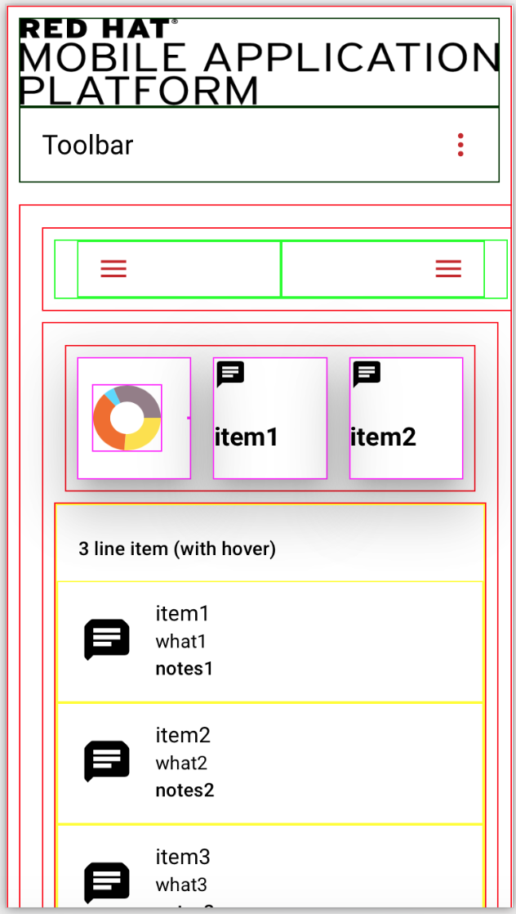
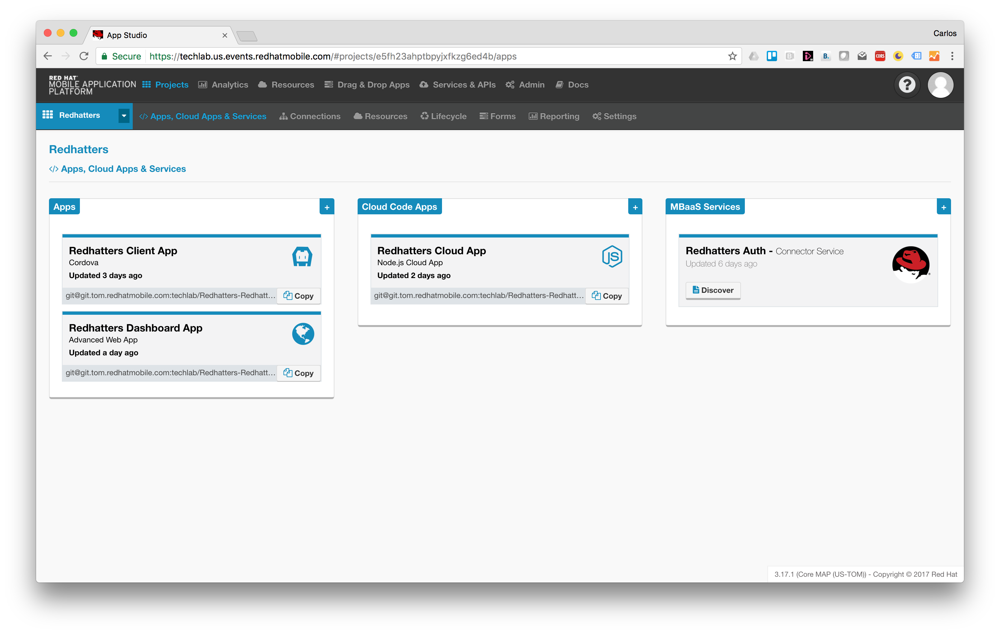
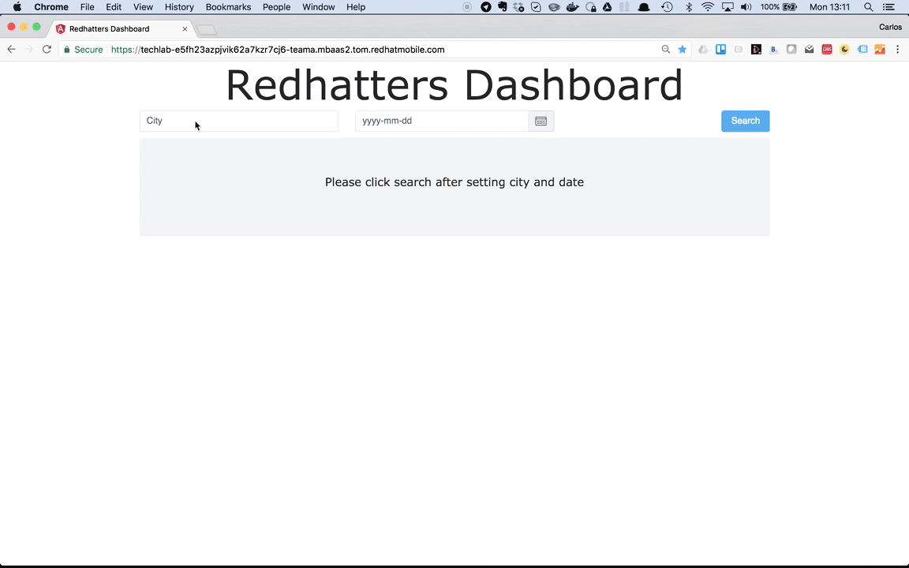

# RHMAP-Demo-Apps
## RHMAP-RSS-Reader-Demo
This is a [demo project](https://github.com/mmetting/RHMAP-RSS-Reader-Demo) utilising various capabilities of the Red Hat Mobile Application Platform. It consists of two client apps (iOS and Ionic) to show RSS feeds from the internet. The RSS feeds are offered by an API within a Cloud Application on Red Hat Mobile. Since feeds are usually exposed as XML-structured data, the feed is transformed and mobile-optimised by means within RHMAP: e.g. the usage of Node modules and the new API-Mapper capability.

## RHMAP-Forms-Submission-Viewer-Demo
This is a [demo project](https://github.com/torbjorndahlen/formsdemo) that uses the `$fh.forms` API to retrieve content submitted through an RHMAP Forms App. It consists of a web app that displays a list of submissions, using `$fh.forms.getSubmissions` from the Cloud App. When selecting a submission the `$fh.forms.getSubmission` is used to retrieve submitted content. The content is examined for the presence of a photo, in which case the `$fh.forms.getSubmissionFile` function is used with the groupId of the photo.

## RHMAP-Chat-Demo
This is a [demo project](https://github.com/torbjorndahlen/kollegornaserver) that uses the `$fh.sync` API to create a simple chat application.

## RHMAP-Angular-Material-Boilerplate
This is a [demo project](https://github.com/torbjorndahlen/md-boilerplate) that provides a boilerplate for mobile apps designed with Angular Material Design. The app is responsive to fit different screen sizes.
It consists of modules that can be added or removed from the basic view. The modules include: a toolbar with a logo that can be replaced, a left sidenav, an analytics panel with a piechart. A choice between a card layout, forms or a list for the main application screen. In addition, the boilerplate also contain AngularJS moduls that can be used to easily plug in RHMAP frameworks such as `$fh.sync`and `$fh.push`into a cordova mobile app.

## RHMAP-IoT-Event-Demo
This is a [demo cordova project](https://github.com/torbjorndahlen/IoTEvent-Demo-App-Client) and [demo project](https://github.com/torbjorndahlen/IoTEvent-Demo-App) that receives Push Notifications using the `$fh-push` API when an event has been generated from an IoT device.

## Example Event App including an interactive Quiz on RHMAP
This is a demo project that could be a starting point for a more ambitious App for events.

Features include:

* Authentication
* Display of Event Agenda
* And an interactive Quiz based on socket.io

It's made of:

* 1 x Hybrid client App (Ionic 2) [code](https://github.com/cvicens/Redhatters-Client-App)
* 1 x Responsive DashBoard to show Quiz results live/historic [code](https://github.com/cvicens/Redhatters-Dashboard-App)
* 1 x Cloud App (featuring socket.io set up for the interactiveQuiz) [code](https://github.com/cvicens/Redhatters-Cloud-App)
* 1 x Authentication MBaaS Service [code](https://github.com/cvicens/Redhatters-Auth)

For an detailed explanation go [here](https://github.com/cvicens/Redhatters-Project)

**Some project pictures**

## RHMAP-Keycloak Demo
This is a [demo project](https://github.com/torbjorndahlen/rhmap-keycloak) that
uses RHSSO (Keycloak) for authenticating users accessing a RHMAP application and how to protect a CloudApp with RHSSO. It uses the Keycloak Javascript adapter to connect an AngularJS app to RHSSO for authenticating the end user and obtain Access Tokens in order to access the REST API of a CloudApp. The CloudApp uses the Keycloak Nodejs adapter to validate the Access Token before allowing access to the REST API from the AngularJS app.
